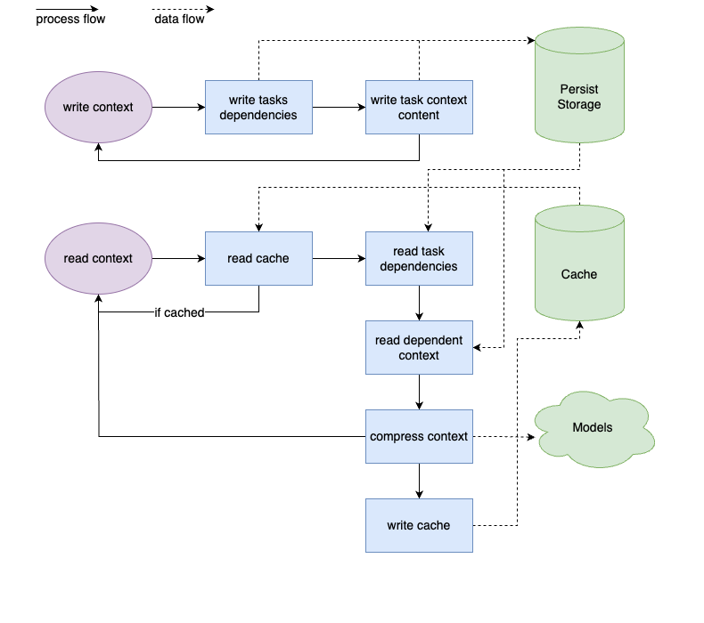

# context-manager
Manage context dependencies of task flows like a tree.And effectively compress the context to achieve the best results.

## Overview

The `context-manager` library is designed to efficiently manage and manipulate context information within distributed systems, particularly for applications that involve complex task dependencies. Utilizing advanced machine learning algorithms for context summarization and compression, along with robust caching mechanisms, `context-manager` aims to optimize both storage and computational efficiency.

By abstracting context from AI model sessions, it enables flexible task allocation across different models, enhancing the scalability and adaptability of Bot Architect.

## Features

- **Context Storage and Retrieval**: Persistent storage for context information, supporting CRUD operations on context data, including versioning and dependency management.
- **Context Compression**: Leverages machine learning algorithms to summarize and compress context data, reducing storage and transmission overhead while preserving essential information.
- **Caching**: Implements a caching layer to store frequently accessed context information, significantly reducing the need for repetitive computation and data retrieval.
- **Version Control**: Manages multiple versions of context data, enabling easy rollback and history tracking of context changes.
- **Dependency Management**: Captures and manages dependencies between tasks, ensuring that context data flows correctly through dependent tasks.

## Design
### Task and context dependencies

### Context management


## Main Modules

### Storage Module
Responsible for the persistent storage of context information, including task dependencies and various context versions.

### Compression Module
Utilizes machine learning techniques to summarize and compress context data, optimizing it for storage and quick retrieval.

### Caching Module
Implements a caching mechanism for storing and retrieving frequently accessed context information, enhancing system performance.

## Getting Started

To get started with `ContextManager`, ensure that you have a compatible Go environment set up. Then, you can include `ContextManager` in your project by adding it as a dependency:


### Install
```bash
go get -u github.com/BotArchitect/context-manager
```

### Interface
```go
// ContextManager defines the interface for managing contexts within the system.
type ContextManager interface {
	// WriteContext writes a new context into the system. It returns an error if
	// the operation fails, for example, if the context already exists for the TaskID.
	//
	WriteContext(ctx context.Context, taskID string, parentTaskID string, content string) error

	// UpdateContext updates an existing context identified by TaskID. It may use
	// the version number to handle concurrency and ensure consistency. It returns
	// an error if the update fails.
	// This is mainly used to correct the context during manual review.
	// If task dependencies change, it is recommended to create a new version instead of updating it directly.
	UpdateContext(ctx context.Context, taskID string, newContent string, version string) error

	// ReadContext retrieves the context based on the TaskID. It returns the corresponding
	// context and an error, if any. The error could indicate that the context does not exist.
	ReadContext(ctx context.Context, taskID string) (string, error)

	// SetVersionLatest set the specified version as the latest version.
	// It usually used to rollback the changes to the history version.
	SetVersionLatest(ctx context.Context, taskID string, version string) error

	// DeleteContext removes a context from the system based on the TaskID. It returns
	// an error if the delete operation fails, for example, if the context does not exist.
	// We may not need to manually delete the context.
	// This method is used to preserve design integrity and can also be used for some rollback operations.
	DeleteContext(ctx context.Context, taskID string) error

	// DeleteContextByVersion removes a specific version context from the system based on the TaskID. It returns
	// an error if the delete operation fails, for example, if the context does not exist.
	// We may not need to manually delete the context.
	// This method is used to preserve design integrity and can also be used for some rollback operations.
	DeleteContextByVersion(ctx context.Context, taskID string) error
}
```

### Example
```go
package main

import (
    "context"
    "github.com/BotArchitect/context-manager"
)

func main() {
    ctx := context.Background()
    cm := contextmanager.New()

    // Writing a new context
    err := cm.WriteContext(ctx, "taskID1", "parentTaskID", "This is the context content")
    if err != nil {
        // Handle error
    }

    // Reading a context
    content, err := cm.ReadContext(ctx, "taskID1")
    if err != nil {
        // Handle error
    }
    fmt.Println("Context Content:", content)
}

```
